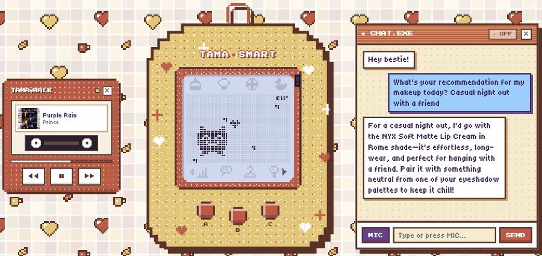
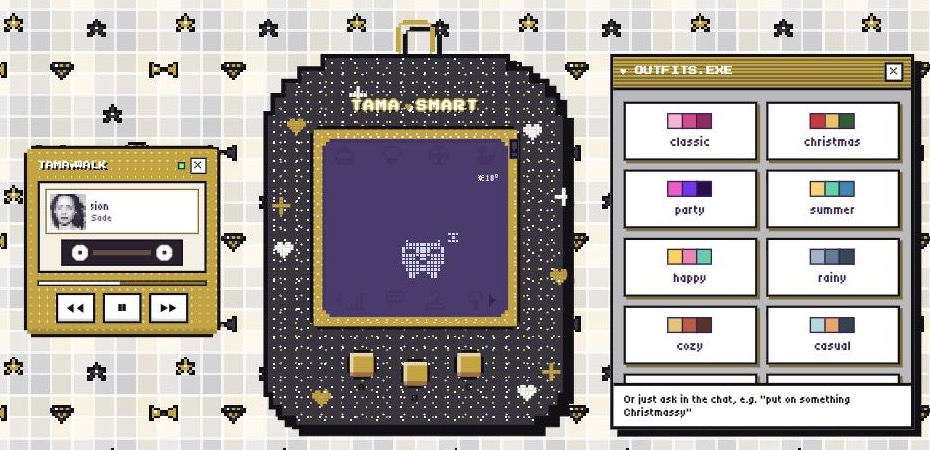
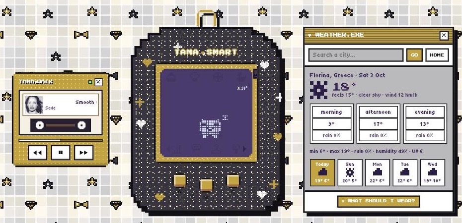
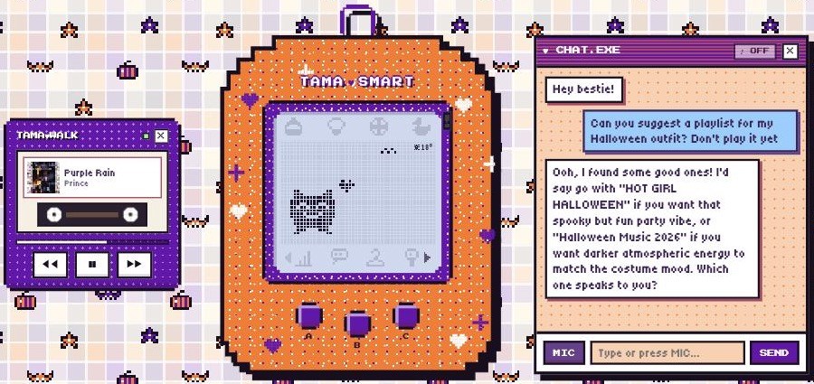
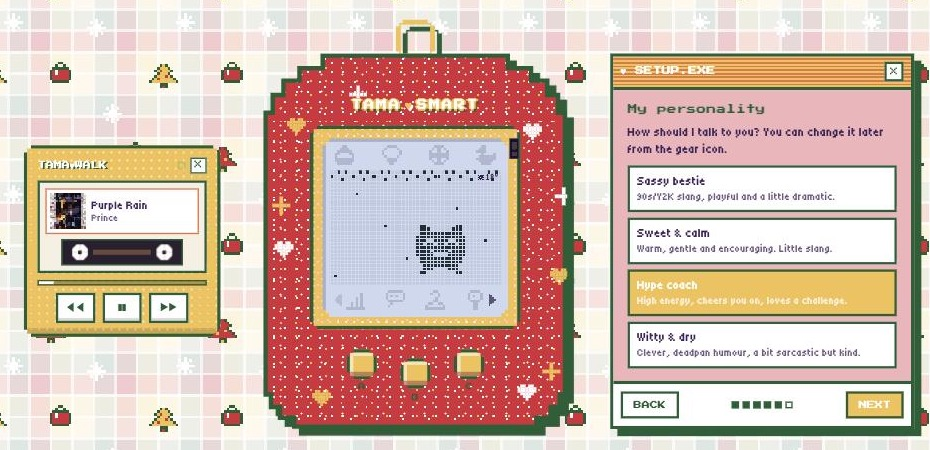
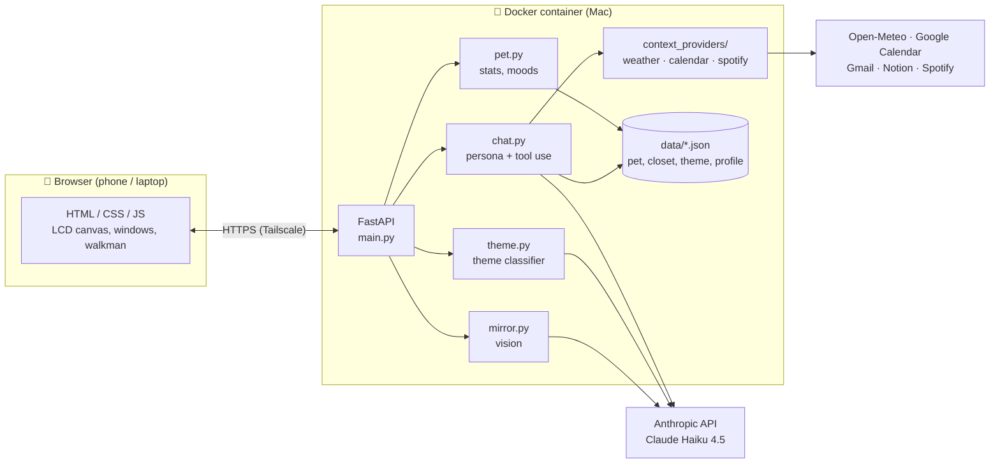
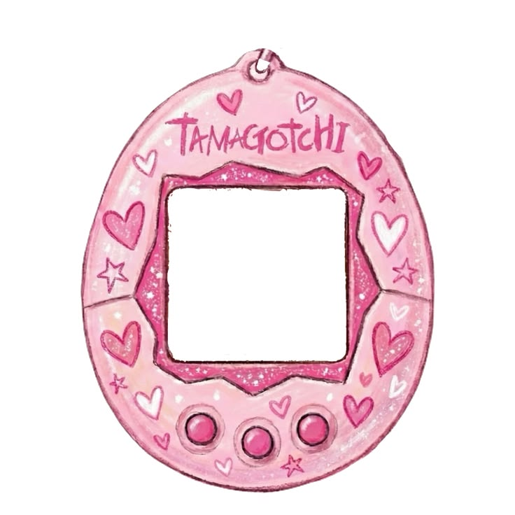

<div align="center">

# ♥ TAMA SMART ♥

**A 90s virtual pet with a 2020s brain.**
A pixel-perfect Tamagotchi that lives in your browser and doubles as an AI bestie for outfits, makeup, weather, plans and music.


<sub><i>TAMA SMART in its <b>classic</b> pink outfit: the glittery device (current temperature in the corner of the LCD, attention LED on the frame) next to the <b>TAMA♥WALK</b> walkman showing what's playing on Spotify.</i></sub>

</div>

---

## 📟 What is it?

TAMA SMART is a niche side project: a **Tamagotchi-style virtual pet** (feed, play, sleep, clean, watch its stats) built with a plain **HTML / CSS / JavaScript** frontend and a **Python FastAPI** backend.

Behind the pixels, the pet talks through the **Anthropic API (Claude Haiku 4.5)** and acts as a personal assistant with a personality: it knows your makeup bag and closet, checks the real weather and your calendar before suggesting an outfit, reads your Notion and Gmail, puts on the right Spotify playlist, and can even look at a photo of what you're wearing.

Everything runs in a **Docker** container on a Mac and is reachable from the phone over **Tailscale** (private HTTPS, only on your own devices).

## 📑 Contents

- [Features](#-features)
- [Architecture](#-architecture)
- [Tech stack](#-tech-stack)
- [Project structure](#-project-structure)
- [Getting started](#-getting-started)
- [Connecting the integrations](#-connecting-the-integrations)
- [Privacy & security](#-privacy--security)
- [Roadmap](#-roadmap)
- [Design inspiration](#-design-inspiration)

---

## ✨ Features

### 🥚 A real virtual pet
- **Care loop:** feed, play, clean up and switch the light off. Hunger, happiness, energy and health drop over time, **even while the app is closed** (the backend simulates the missed minutes). Neglect it for too long and it gets sick… or worse.
- **Life stages:** egg → baby → child → adult, each with its own pixel sprite.
- **Moods with real feedback:** happy, hungry, tired, sad, sick, thinking, curious… each mood changes the pet's **face, movement and LCD effects** (tears, a food thought bubble, a blinking skull, "z"s) and plays its own **8-bit piezo-buzzer tune**, like the original 90s devices.
- **Authentic controls:** A / B / C buttons (or ← / Enter / Esc), a paged icon bar with ‹ › arrows, and an attention LED on the frame that blinks when the pet needs you.

### 💬 An AI bestie in the chat (CHAT.EXE)
- Powered by **Claude Haiku 4.5** with **tool use**: the model decides when it needs data and calls small Python functions to get it.
- **Closet-aware:** suggests outfits and makeup **only from the items you own**, and you can add, update or remove items just by chatting ("I bought a new NYX lip gloss").
- **Weather-aware:** checks the real forecast (Open-Meteo) for today, another day or another city, then suggests layers, rain-proof pieces, long-wear makeup or sunscreen.
- **Calendar-aware:** reads Google Calendar, so a meeting at 10 and dinner at night lead to an outfit that works for both.
- **Notion & Gmail:** discusses your Notion tasks and notes (and can append to a page) and summarises recent emails (read-only).
- **Voice:** dictate with the MIC button and hear the replies read aloud in Greek.
- **Personalities:** sassy bestie, sweet & calm, hype coach, or witty & dry. Picked during onboarding, it changes how the pet talks.

<div align="center">


<sub><i><b>CHAT.EXE</b> in the <b>cozy</b> outfit: asked for a makeup recommendation for a casual night out, the pet picks a long-wear lip cream and a neutral eyeshadow from the user's own makeup bag. (The app chats in Greek; this screenshot shows an English reply.)</i></sub>
</div>

### 👗 Outfits & themes (OUTFITS.EXE)
- Ask in plain language ("put on something Christmassy", "it's rainy today, dress for it") or pick one of **15 looks** from the list: classic, Christmas, party, summer, happy, rainy, cozy, casual, athletic, office, formal, Y2K, 70s, 80s, Halloween.
- A small classifier call with **structured JSON output** tells theme requests apart from normal chat. Colors flow through **animated CSS variables**, the pixel wallpaper is redrawn and cross-faded, and each look has its own LCD effect (snow, rain, confetti, a disco ball…).
- Every change plays a **transformation animation**: shake, shine sweep, sparkle burst and a jingle.

<div align="center">


<sub><i><b>OUTFITS.EXE</b> while wearing <b>Y2K</b>: lilac and baby pink, a wallpaper of butterflies and flip phones, and a butterfly fluttering across the LCD. Each card shows a look's palette; the list scrolls inside the window and is generated from the backend's preset registry.</i></sub>
</div>

### 🌦️ Weather (WEATHER.EXE)
- Current temperature and "feels like", morning / afternoon / evening, rain chance, wind, humidity and UV, plus a **7-day strip** and **city search**.
- A tiny temperature reading sits in the corner of the LCD (hover it for a tooltip).
- **"What should I wear?"** sends the selected day and city straight to the chat.

<div align="center">


<sub><i><b>WEATHER.EXE</b> in the <b>formal</b> outfit (black and gold, bow ties and diamonds): today in detail for the home city, the next days with pixel weather icons, and a button that asks the pet what to wear.</i></sub>
</div>

### 🪞 Mirror mode (MIRROR.EXE)
- Take a photo of today's outfit with the camera (front camera by default, with a FLIP button) or pick one from the gallery.
- **Claude vision** compares it with the outfit the pet suggested earlier that day and answers in JSON: match level, what matches, what differs and a warm 1–2 sentence comment with a practical tip. It comments **only on clothes and styling**, never on the body.
- The verdict becomes a short **mood reaction** on the pet (happy / thinking / curious).
- Photos are validated, shrunk to 1024 px **in memory** and **never stored**.

### 🎵 Spotify (TAMA♥WALK)
- A retro **walkman** next to the device shows what's playing: pixelated album art, a scrolling title, spinning cassette reels, a progress bar and ◀◀ ❚❚ ▶▶ controls. Close it with × and bring it back from the ♪ icon.
- In the chat: "put on some music for my cozy outfit" → the pet turns the mood into search words, finds a playlist and plays it (Spotify Premium).

<div align="center">


<sub><i>Spotify in the <b>Halloween</b> outfit (pumpkins and bats on the wallpaper): the pet searches Spotify and suggests playlists that match the costume, while the walkman shows the current track.</i></sub>
</div>

### 📅 Calendar (CALENDAR.EXE)
- A 7-day agenda from Google Calendar (titles, times and locations only). Pick an event and ask "what should I wear for it?".

### 🐣 Onboarding (SETUP.EXE)
- On first use, a wizard explains the pet, how to keep it alive and what every icon does, then asks for the **pet's name**, **what to call you** and its **personality**. The gear icon reopens it at any time.

<div align="center">


<sub><i><b>SETUP.EXE</b> in the <b>Christmas</b> outfit (garland and falling snow on the LCD): the personality step, with four personalities to choose from. The pixel dots show the progress through the six steps.</i></sub>
</div>

### 🔔 Notifications (Telegram + NOTIFS.EXE)
- A background notifier checks every few minutes and messages you on **Telegram**, through your own bot:
  - **Calendar:** a heads-up ~30 minutes before an event (only when there is one).
  - **Pet care:** hungry, sick, dirty, or in danger, at most once every few hours per issue.
  - **Morning digest:** a short good-morning note with the weather, today's events (if any) and an outfit idea, written by the pet with the normal chat tools.
- Quiet hours, digest time and a daily limit live in `config/settings.json`; the bell icon opens an in-app inbox with the same messages.
- New sources are small `NotificationProvider` modules in `backend/notification_providers/`.

### 📚 Library (LIBRARY.EXE)
- A **personal knowledge base drawn as a bookshelf**: each book is a topic, its chapters are sub-topics, and chapters hold **Markdown notes** (code blocks with syntax highlighting, tags, created/edited dates). Spines get their own color, height and thickness (more notes = thicker book); a book flies off the shelf and opens when clicked.
- Full create / edit / rename / move / delete, a search box that works on its own, and **imports of .txt, .md and .pdf** files from the library or straight from the chat. The place to file an import is suggested **locally**, by comparing it with existing notes.
- In the chat the pet searches the notes when a question might be answered by them, **cites the book and chapter** it used (with a link to the note), and can save an answer on request: *"αποθήκευσε αυτό στο βιβλίο Προγραμματισμός, κεφάλαιο Python"*.
- Books or chapters can be marked **private**: they're excluded from the chat and its search at the SQL level.

### 📱 Works on the phone
- Served over **HTTPS through Tailscale**, so the camera and microphone work on the iPhone too. On small screens the windows open as a bottom panel.

---

## 🏗️ Architecture



**Design decisions worth a look:**
- **Tool use instead of keyword matching.** The model calls `get_weather`, `get_events`, `find_playlists`, `add_item`… only when it needs them, so unrelated messages cost no extra tokens and "a trip to Thessaloniki on Saturday" just works.
- **Context providers.** Each outside source (weather, calendar, Spotify) is a small `ContextProvider` with its own tools and prompt section. Adding one (e.g. a habit tracker) is a new file plus one line in a list; the chat core doesn't change.
- **Registries over code.** Themes (`PRESETS`) and personalities (`PERSONALITIES`) are data: the classifier prompt, the JSON schema, the outfit list and the wizard are all generated from them.
- **Structured outputs** for the theme classifier and Mirror mode, so their JSON is always valid.
- **Swappable search.** The library's full-text search (SQLite FTS5 with accent-insensitive prefix matching, so Greek word endings match) sits behind a small `SearchBackend` interface; a vector store / RAG backend can replace it without touching the rest. Only the few notes a search picks for a question are sent to the model, never the whole library.
- **Safe persistence.** Atomic, uniquely named temp-file writes plus locks, after a real race condition corrupted a JSON file under concurrent requests.

## 🧰 Tech stack

| Layer | Tools |
|---|---|
| Frontend | Vanilla JavaScript, HTML, CSS (`@property` animated variables, container queries, canvas pixel art), Web Speech API, `getUserMedia`, marked + DOMPurify + highlight.js (vendored) |
| Backend | Python 3.12, FastAPI, Uvicorn, Pydantic, Pillow, SQLite (FTS5), pypdf |
| AI | Anthropic API (Claude Haiku 4.5): tool use, structured outputs, vision |
| Integrations | Open-Meteo, Google Calendar & Gmail (read-only OAuth), Notion API, Spotify Web API (OAuth PKCE) |
| Infrastructure | Docker Compose, Tailscale Serve (HTTPS) |

## 🗂️ Project structure

```
tamagotchi/
├── backend/
│   ├── main.py                 # FastAPI app and all /api routes
│   ├── pet.py                  # pet simulation, moods, reactions
│   ├── chat.py                 # persona, system prompt, tool-use loop
│   ├── closet.py               # makeup & clothes storage + edits
│   ├── theme.py                # theme presets + classifier (structured output)
│   ├── mirror.py               # Mirror mode: image checks + vision
│   ├── outfit_of_day.py        # today's suggested outfit (for Mirror)
│   ├── owner_profile.py        # onboarding answers + personalities
│   ├── weather.py              # Open-Meteo service (cache + timeouts)
│   ├── calendar_reader.py      # Google Calendar (read-only)
│   ├── gmail_reader.py         # Gmail (read-only)
│   ├── notion_reader.py        # Notion search / read / append
│   ├── spotify_client.py       # Spotify (PKCE login, playback)
│   ├── google_auth.py          # one Google login for Gmail + Calendar
│   ├── context_providers/      # pluggable chat context (weather, calendar, spotify)
│   ├── library/                # knowledge base: SQLite store, FTS5 search, importer, chat tools, routes
│   ├── storage.py, settings.py # safe JSON writes, config loading
│   └── data/                   # runtime JSON state + library.db (git-ignored)
├── frontend/
│   ├── index.html, style.css
│   ├── app.js                  # device, LCD rendering, windows, chat, voice
│   ├── library.js              # LIBRARY.EXE: shelf, open book, editor, imports
│   ├── themes.js               # theme colors, wallpaper, LCD effects
│   └── vendor/                 # marked, DOMPurify, highlight.js (served locally)
├── config/settings.json        # home city for the weather
├── docs/images/                # README screenshots & inspiration
├── Dockerfile, docker-compose.yml
└── .env.example                # API keys template (real .env is git-ignored)
```

---

## 🚀 Getting started

### Prerequisites
- [Docker Desktop](https://www.docker.com/products/docker-desktop/)
- An [Anthropic API key](https://console.anthropic.com/)
- Optional: [Tailscale](https://tailscale.com/download) on the Mac and on your phone

### 1. Clone and configure

```bash
git clone https://github.com/fanitarantsopoulou/tamagotchi.git
cd tamagotchi
cp .env.example .env
```

Open `.env` and fill in at least:

```env
ANTHROPIC_API_KEY=sk-ant-...
```

Optionally set your home city in `config/settings.json`:

```json
{ "weather": { "city": "Florina", "country_code": "GR" } }
```

### 2. Run it with Docker

```bash
docker compose up -d --build
```

Open **http://localhost:8000**. The setup wizard will greet you on the first visit.

The container restarts by itself whenever Docker Desktop is running. Useful commands:

| What | Command |
|---|---|
| Rebuild after code changes | `docker compose up -d --build` |
| Follow the logs | `docker compose logs -f` |
| Stop | `docker compose down` |
| Reload `.env` changes | `docker compose up -d --force-recreate` |

Pet state, closet, theme and profile live in `backend/data/` on the Mac (mounted into the container), so rebuilds never reset your pet. `config/` and `secrets/` are mounted too.

### 3. Open it on your phone (Tailscale)

With Tailscale installed and logged in on both the Mac and the phone:

```bash
tailscale serve --bg 8000
```

The app is then available at `https://<your-mac>.<your-tailnet>.ts.net`, **only on your own devices**, with a real HTTPS certificate (needed for the camera and microphone). In Safari, use *Share → Add to Home Screen* to get an app icon.

### Run without Docker (development)

```bash
python3.12 -m venv .venv
.venv/bin/pip install -r backend/requirements.txt
cd backend && ../.venv/bin/uvicorn main:app --reload
```

---

## 🔌 Connecting the integrations

All integrations are optional. Each one switches itself on once it's configured.

| Integration | How to connect |
|---|---|
| **Weather** | Works out of the box (Open-Meteo, no key). Set the city in `config/settings.json`. |
| **Notion** | Create an internal integration at notion.so/profile/integrations with *Read content* (and *Insert content* to let the pet write), add `NOTION_TOKEN=ntn_...` to `.env`, then share pages with it (••• → Connections). |
| **Google Calendar + Gmail** | In Google Cloud: enable the Gmail and Calendar APIs, create a *Desktop app* OAuth client and save its JSON as `secrets/google_credentials.json`. Then run `.venv/bin/python backend/google_auth.py` on the Mac once (read-only access). |
| **Telegram** | Create a bot with @BotFather, add `TELEGRAM_BOT_TOKEN=...` to `.env`, send `/start` to your bot, then run `.venv/bin/python backend/telegram_client.py` once to link your chat. |
| **Spotify** | Create an app at developer.spotify.com/dashboard with the redirect URI `http://127.0.0.1:8765/callback`, add `SPOTIFY_CLIENT_ID=...` to `.env`, then run `.venv/bin/python backend/spotify_client.py` once. Playback control needs Premium. |

After adding keys to `.env`, run `docker compose up -d --force-recreate`.

---

## 🔒 Privacy & security

- **Keys stay local.** `.env` and `secrets/` are git-ignored and never baked into the Docker image (`.dockerignore`); they're read at runtime.
- **Private network only.** The container listens on `127.0.0.1`; Tailscale exposes it to your own devices over HTTPS.
- **Least privilege.** Gmail and Calendar are read-only; Spotify asks for 3 playback scopes; Notion only sees the pages you share.
- **No photo storage.** Mirror photos exist only in memory for one request.
- **Prompt-injection aware.** Text from emails, pages, events or images is treated as information, never as instructions; destructive actions only happen on the user's own request.
- **Library notes stay local.** They live in a SQLite file on the Docker volume, are never logged (searches are POSTed so queries stay out of access logs), and imported files are read in memory only. The chat sees book/chapter titles and only the notes a search picks for the current question; private books and chapters never reach it.
- **What leaves the machine:** chat messages, and any data the pet reads to answer them, are sent to the Anthropic API.

## 🗺️ Roadmap

The full list of implemented and planned features lives in [issue #6](https://github.com/fanitarantsopoulou/tamagotchi/issues/6). Next up: Notion task reminders, habit tracking with streaks, long-term chat memory, and maybe a Raspberry Pi / cyberdeck build.

## 🎨 Design inspiration

The look started from a small moodboard. These images are **references only** and belong to their respective owners.

<table>
  <tr>
    <td align="center" width="50%">
      <br>
      <sub>The pink, glittery Tamagotchi shell with hearts and stars that inspired the device and its <b>TAMA♥SMART</b> branding.</sub>
    </td>
    <td align="center" width="50%">
      <br>
      <sub>Pastel pixel art with a plaid pattern, hearts and tiny Tamagotchi eggs: the source of the generated <b>pixel wallpaper</b>.</sub>
    </td>
  </tr>
</table>

<div align="center">
<br>
<sub>Made with ♥, pixels and way too many 8-bit beeps.</sub>
</div>
